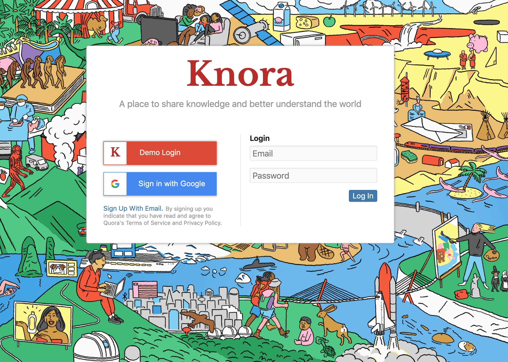
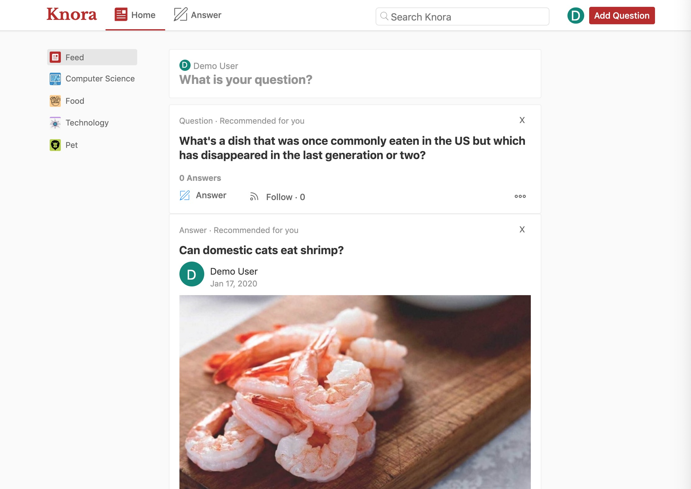

# README

## Overview
[Knora](https://knora.herokuapp.com) is a clone of Quora. Knora was built with Ruby on Rails backend and React with Redux on the frontend.

Live demo: https://knora.herokuapp.com

## 

# Technology Used

### Backend
- Rails
- jBuilder
- PostgreSQL

### Frontend
- React
- Redux
- React router
- Quill

# Features

- user can create a new accout or login with google account
- User can post and answer questions
- User can edit/delete one's own questions/answers
- User can specify topics when posting question
- User can search answers for a question
- User can follow a question
- User can vote to a answer
- User can browse question by topic
- Show related questions when viewing a question
- Automatically load more questions when hitting bottom

