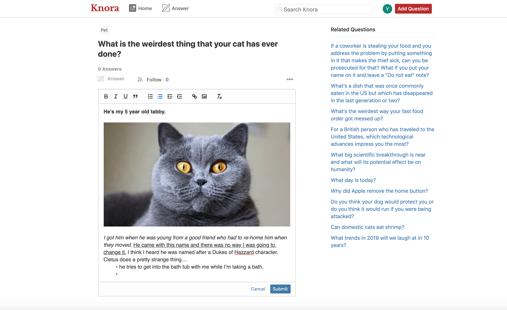

# Overview
[Knora](https://knora.herokuapp.com) is a clone of Quora. Knora was built with Ruby on Rails backend and React with Redux on the frontend.

Live demo: https://knora.herokuapp.com

## 


# Technology Used

### Backend
- Rails
- jBuilder
- PostgreSQL

### Frontend
- React
- Redux
- React router
- Quill

# Libraries

### react-quill
- Knora utilized Quill.Js to enrich text editing experience. When user tries to create/edit an answer, they can add images, change font weight/size, format text(bullet point, identation) and more. 




### Google API OAuth2

- Knora allows user to login with their google account, making the login workflow much easier. On client-side, I retrieve user ID token from Google API console. On server-side, I utilized GoogleIDToken to verify login authenticity using id token. After validation succeeded, a new account will be created for first time user.

client
```javascript 
// frontend/components/session/google_signin.jsx
export default class GoogleSignIn extends React.Component {
  // ...
  componentDidMount() {
      // Keep checking until Google API is loaded successfully. Then render login button.
      const intervalId = setInterval(() => {
        if (gapi) {
          this.renderGoogleLoginButton();
          clearInterval(intervalId);
        }
      }, 100);
  }
  
  onSuccess(googleUser) {
    // Send id_token retrieved from Google login to server
    this.props.loginWithGoogle(googleUser.getAuthResponse().id_token);
  }
  
  renderButton() {
    gapi.signin2.render(GOOGLE_BUTTON_ID, {
      // ...
      onsuccess: this.onSuccess,
    });
  }
}
```

server
```ruby
  # app/controllers/api/sessions_controller.rb
  def handle_google_login
    validator = GoogleIDToken::Validator.new
    begin
      # ...
      # Validate user credential using GoogleIDToken
      payload = validator.check(params[:id_token], JWT.decode(params[:id_token], nil, false)[0]["aud"], client_id)
      email = payload['email']
      @user = User.find_by(email:email)
      # Verified current user credential, log user in.
      # ...
    rescue GoogleIDToken::ValidationError => e
      report "Cannot validate: #{e}"
    end
  end
```

# Features

- user can create a new accout or login with google account
- User can post and answer questions
- User can edit/delete one's own questions/answers
- User can specify topics when posting question
- User can search questions and search results are listed in most relevant order.
- User can follow a question
- User can vote to a answer
- User can browse question by topic
- Show related questions when viewing a question
- Automatically load more questions when hitting bottom

